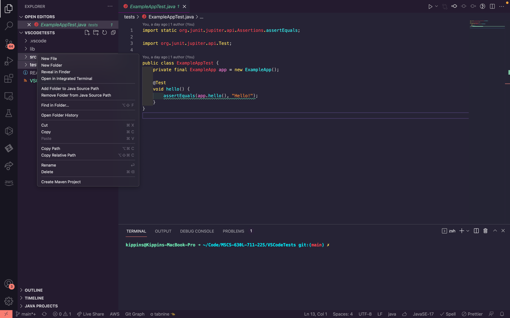
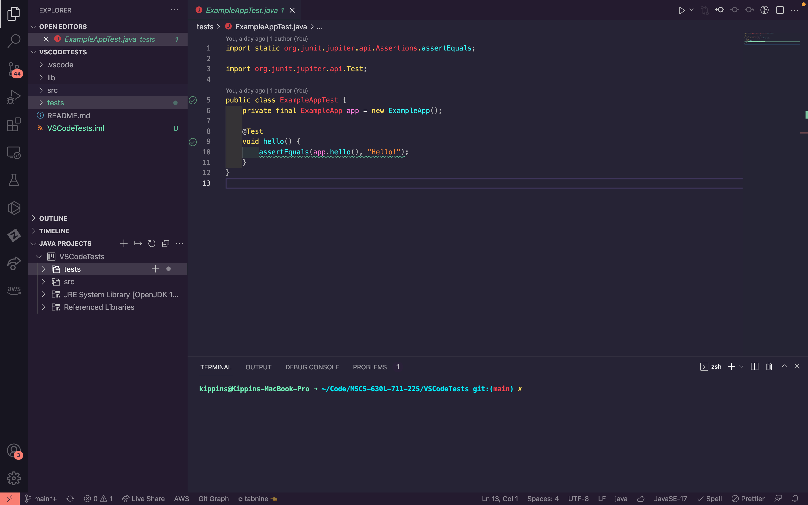
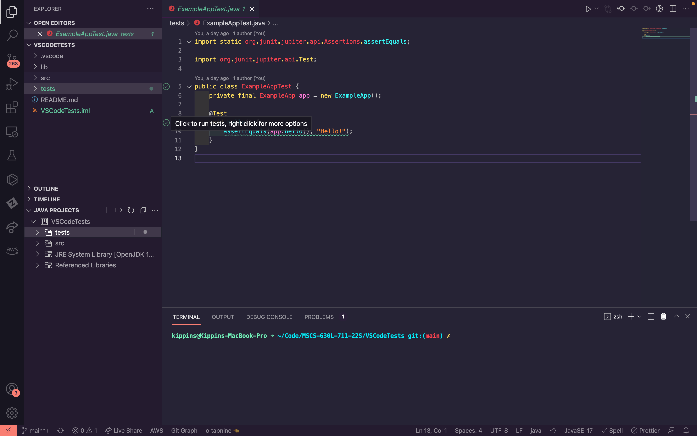
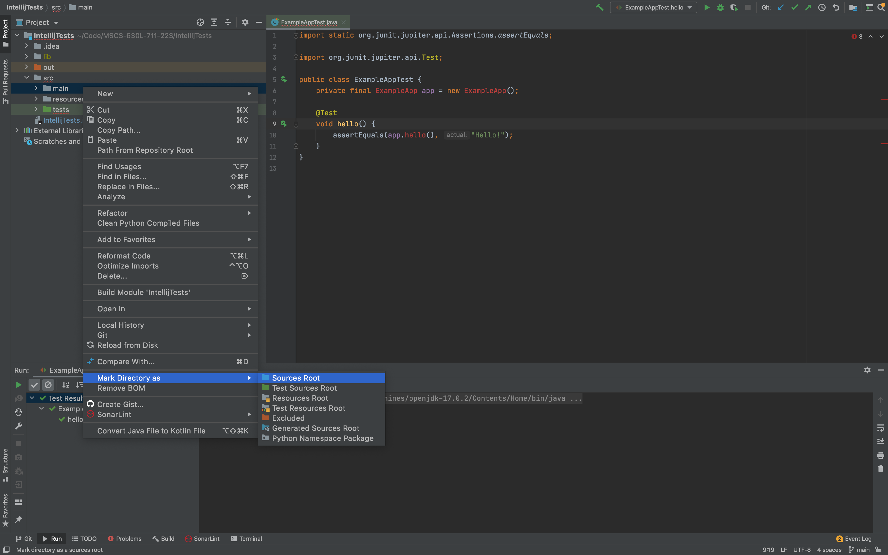
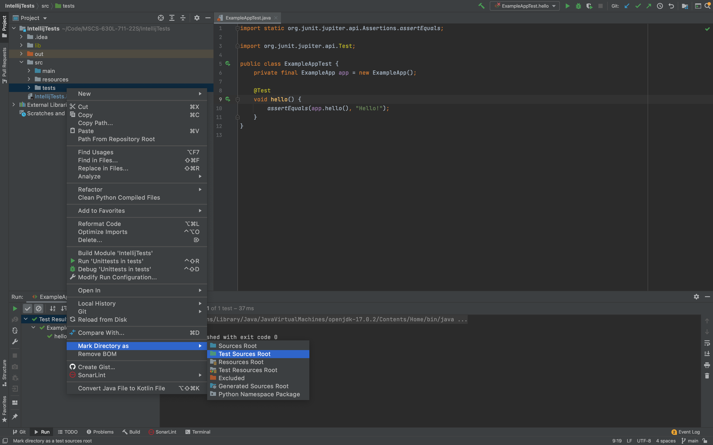
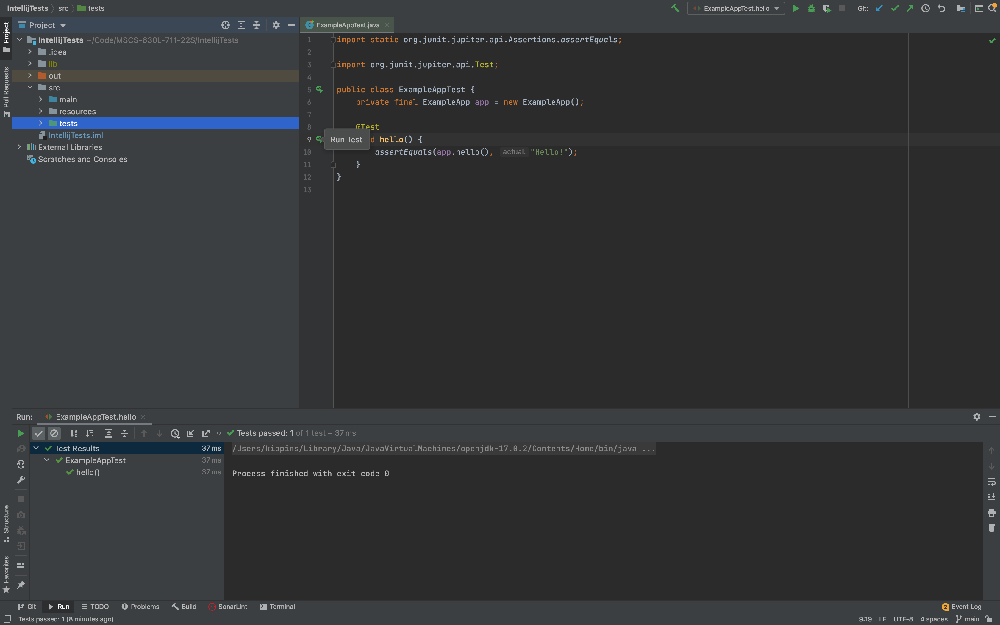

# MSCS-630L-711-22S

In order to run the junit test cases we're going to need a couple things to happen. These things look a little different depending on the program you're in. The underlying goal is the same though! We need to get our files into our Java Class Path. We also need to have the JUnit Libraries. For the second part I included the library files in the project in the lib folder. Hopefully that'll cover you there but if JUnit is missing you may need to mess around there. For now I'll assume the test cases are working and then push again with more instruction. For now let's talk about getting things into the class path for the two editors.

For both editors this should be relatively easy. 

***Important Note** : When opening the folder to test out of the test cases as they are need to be opened as the project. So if opening in VSCode, VSCode tests would be the project to open. Not the parent directory of MSCS-630L-711-22S.
## VSCode
Adding our directories to our class path is pretty simple in VSCode. We're going to right click on our src folder and our tests folder and click on `Add folder to Java Source Path`

That will add the folders into your class path and you can check that by checking the Java Project in the lower left.

From here if we go to the test we should have access to run it!

## IntelliJ

For IntelliJ this is fairly simple as well! We need to right click and then hover mark directory as and then click sources root for our code.

Then for the tests it's the same thing but clicking Test Sources Roots.

From here if we go to the test we should have access to run it!

